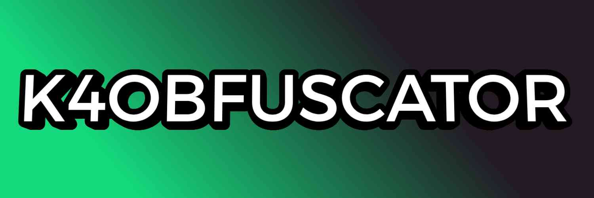

This is a fair introduction to our project, K4Obfuscator.

### 🔔 Security

It's quite a delicate matter to introduce a new lua obfuscator nowday, as it is likely to be a fork from a past obfuscator. Indeed there were cases in which some "devs" faked to bring a new fresh obfuscator as a paid service.

For this reason we decided to bring what's good from past obfuscation methods and start implementing new features that would make our **free service** unique and updated.

_We designed this obfuscator as a free obfuscation service to share your scripts. But we surely encourage using paid obfuscators for commercial purposes which require high obfuscation standards_

### Motivation

This is what we mean for "play it straight", the main goals behind this project is to create a free obfuscator for personal use. We are able to keep this service free thanks to our ad-key based system.

### Logging scripts

**Absolutly no**, even if this would allow malicius scripts to be obfuscated using this **we don't provide any type of logs**.

