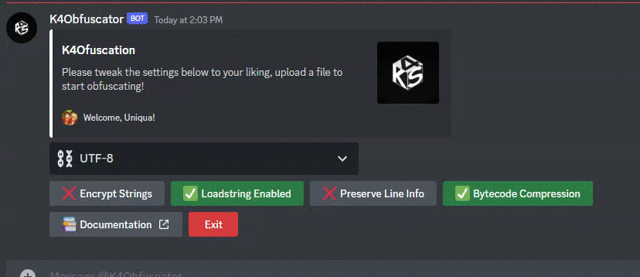

# Tutorial Intro

Let's discover **K4Obfuscator in less than 5 minutes** ⌛.


### What you'll need

- [Discord](https://k4scripts.xyz/discord)
- [Key](#getting-started)
- [Lua Script](https://www.lua.org/manual/5.1)

## Syntax
K4Obfuscator is built on top a custom lua parser which is able to transform special syntax into a supported Lua 5.1 syntax

**Supported syntax:**
* Lua 5.1 base syntax
* Compound operators
* Continue keyword
* Typed Lua
* C style comments...

:::info
We are always open to syntax support requests! 🎉🎉
:::

## Getting Started

Get started by **requesting an obfuscation key from the K4Obfuscator bot**.


## Obfuscate your first script

Let's prepare a script to obfuscate..
```lua
-- #script.lua
local n = {'a', 'b', 'c'};
local function f()
  local r = '';
  for i=1, #n do
    r = r .. n[math.random(1, #n)];
  end
  return r;
end
print(f());
```

Start obfuscating by running `/obfuscate <key>`.

The bot will prompt you a display with buttons that will help you setup your obfuscation environment:


[Download Output](img/obfuscated.lua)