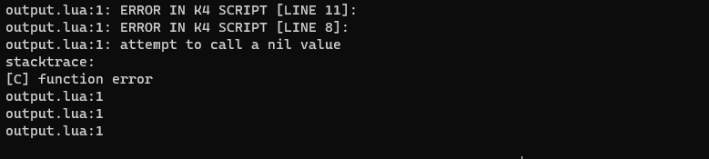

# Settings Introduction

Settings allow you to setup your obfuscation enviroment and control how your script will be obfuscated.

## 📦 Bytecode Compression

Smaller bytecode size means smaller output size.

### Compression Types
* **UTF-8**   (default)
* **NORMAL**

## 🐛 Preserve Line Info

Preserve line info will preserve corrisponding lines to all instructions in order to debug your script.
> Due to ast transformations line info might be inaccurate. (WIP)

:::warning
Keeping this setting on production scripts is not recommended.
:::

## 🔒 Encrypt Strings

*Encrypt Strings* will only encrypt important constant strings automatically, without the need to specify which one encrypt with the [K4_ENCRYPT](/docs/tutorial-macros/encrypt.md) macro.

:::info Triggers: 
- `local`
- `http`
:::

## 📜 Loadstring Enabled

*Loadstring Enabled* will allow the vm to take advantage of [loadstring](https://www.lua.org/manual/5.1/manual.html#pdf-loadstring) function enhanching protections.

## 📜 Compress Output
*Compress Output* reduces output size by compressing output code and executing it on the fly.
:::info
This option require `Loadstring Enabled` to be on.
:::
:::warning
It is been proved to slow down startup execution time, as decompression is taken in place.
:::